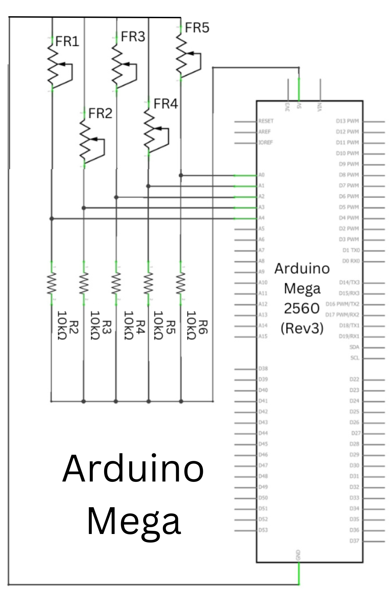
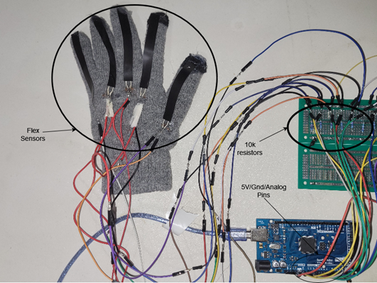

# SignSpeak: Time Series Classification for ASL Prediction

This repository contains the code and dataset for the paper "SignSpeak: Time Series Classification for ASL Prediction." Here is the [paper]().

## Overview

**Abstract**: The lack of fluency in sign language remains a barrier to seamless communication for hearing and speech-impaired communities. In this work, we propose a low-cost real-time ASL-to-speech translation glove and an exhaustive training dataset of sign language patterns. We then benchmark this dataset with supervised learning models including LSTMs, GRUs and Transformers achieving 92\% accuracy. The SignSpeak dataset has 7200 samples encompassing 36 classes (A-Z, 1-10) and aims to capture realistic signing patterns by using five low-cost flex sensors to measure finger positions at each time step at 36 Hz. SignSpeak indicates the strong feasibility of a cost-effective and resource-efficient ASL translator on a standardized dataset.

## Data Glove

The glove uses
- **Flex Sensors**: Five flex sensors are integrated into the glove, one for each finger. These sensors measure the bend of each finger.
- **Microcontroller**: An Arudino MEGA 2560 processes the signals from the flex sensors and sends the data verial serial ouput to a database.

All code for glove setup and data collection can be found at ``src/dataCollection```

Below is the schematic and completed glove.


<p align="center">
  
  
</div>

## Key Features

- **Open-Source Dataset**: The SignSpeak dataset comprises 7200 samples covering 36 classes (A-Z, 1-10), collected at 36 Hz using five flex sensors.
- **High Accuracy**: Achieves 92% categorical accuracy using state-of-the-art models such as LSTMs, GRUs, and Transformers.
- **Real-World Applicability**: Designed to be a cost-effective and resource-efficient solution for seamless communication for the hearing and speech-impaired communities.

## Models

The repository includes implementations and benchmarks for various models:
- Stacked LSTM
- Stacked GRU
- Transformer-based models

All models can be found in ``` src/models/ ```

## Getting Started

1. **Clone the Repository**
   ```bash
   git clone https://github.com/adityamakkar000/ASL-Sign-Research.git
   ```
2. **Download the Dataset**

    Download the dataset from this [Harvard Dataverse](https://doi.org/10.7910/DVN/ODY7GH) and place it in the ```src/experiments/data``` directory naming it ```data.csv```.

3. **Install Dependencies**

    ```bash
    pip install -r requirements.txt
    ```
4. **Run the model**
     Run the models using the following bash command inside of the src/experiments/ or use the training scripts found in the directory
    ```bash
    python LightningTrain.py \
          -layers $layers \
          -model $model \
          -hidden_size $hidden_size \
          -lr $lr \
          -time_steps $time_steps \
          -batch_size $batch_size \
          -epochs $epochs \
          $dense_layer_arg \
          -dense_size $dense_size \
    ```

## Contact

For any queries, please contact:

    Aditya Makkar: adityamakkar000@gmail.com
    Divya Makkar: divyamakkar000@gmail.com
    Aarav Patel: aaravp0905@gmail.com
